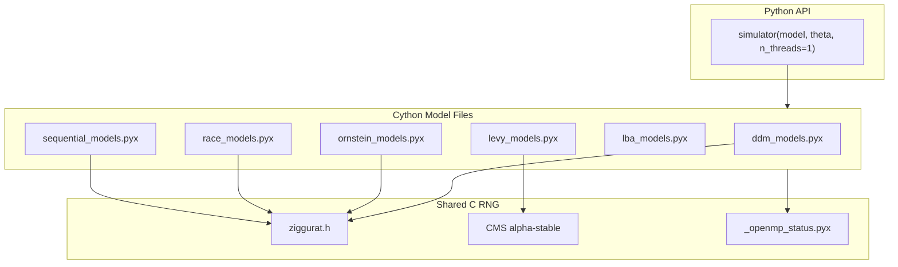

# Cython Simulator Parallelization (Revised)

## Overview

Add multi-threading support to all Cython simulators by integrating the new C-level RNG (Ziggurat) and OpenMP parallelization directly into each model family, with OpenMP as an optional dependency that gracefully degrades to sequential execution.

## Key Change from Previous Plan

**Removed the `_kernels.pxd` abstraction layer.** Analysis of the codebase revealed that:

1. **Model hot loops differ significantly:**

   - DDM: `y += v*dt + sqrt_st * gaussian`
   - Ornstein: `y += (v - g*y)*dt + sqrt_st * gaussian` (mean-reversion)
   - Levy: `y += v*dt + delta_t_alpha * alpha_stable` (different noise type)
   - Race: Multiple particles racing in parallel
   - LBA: **No random walk at all** - purely analytical: `rt = (a-z)/v`

2. **A unified kernel adds complexity without benefit.** Each model needs its own hot-loop logic.

**New approach:** Directly add `n_threads` to each model, reusing the existing C RNG infrastructure ([`ziggurat.h`](src/cssm/ziggurat.h), [`_c_rng.pyx`](src/cssm/_c_rng.pyx)).

---

## Architecture (Simplified)



---

## Implementation Phases

### Phase 0: Make OpenMP Optional (DONE)

- [x] `setup.py`: `openmp_available()` detection function
- [x] `src/cssm/_openmp_status.pyx`: Runtime detection with `check_parallel_request()`
- [x] Build tested with OpenMP enabled

---

### Phase 1: DDM Models (Primary Target)

Add `n_threads` to all 11 functions in [`src/cssm/ddm_models.pyx`](src/cssm/ddm_models.pyx):

**Implementation pattern:**

```cython
def ddm_flexbound(..., int n_threads=1):
    n_threads = check_parallel_request(n_threads)

    if n_threads == 1:
        # Sequential path (same as original but with C RNG)
        for k in range(n_trials):
            for n in range(n_samples):
                # ... existing hot loop ...
    else:
        # Parallel path
        with nogil, parallel(num_threads=n_threads):
            for k in prange(n_trials):
                for n in range(n_samples):
                    # ... hot loop with C RNG, no trajectory recording ...
```

**Functions (priority order):**

1. `ddm_flexbound` - Most used (default DDM)
2. `ddm`, `full_ddm`, `full_ddm_rv` - Common variants
3. `ddm_sdv`, `ddm_flex`, `ddm_flex_leak` - Extended variants
4. `full_ddm_hddm_base`, `ddm_flexbound_tradeoff` - Specialized

**Validation:** Run `pytest tests/test_simulator.py -v` after each function.

---

### Phase 2: Python API Integration

Add `n_threads` to [`ssms/basic_simulators/simulator.py`](ssms/basic_simulators/simulator.py):

```python
def simulator(theta, model="angle", ..., n_threads=1):
    ...
    sim_param_dict['n_threads'] = n_threads
    return model_config['simulator'](**sim_param_dict)
```

---

### Phase 3: Other Model Families

| Model File | Functions | Parallelization Approach |
|------------|-----------|--------------------------|
| [`levy_models.pyx`](src/cssm/levy_models.pyx) | 1 | C-level CMS for alpha-stable (already in `_parallel_gsl.pyx`) |
| [`ornstein_models.pyx`](src/cssm/ornstein_models.pyx) | 1 | Same as DDM + mean-reversion term |
| [`race_models.pyx`](src/cssm/race_models.pyx) | 2 | Parallelize over trials (multiple particles per sample) |
| [`sequential_models.pyx`](src/cssm/sequential_models.pyx) | 10 | Parallelize over trials (multi-stage) |
| [`lba_models.pyx`](src/cssm/lba_models.pyx) | 4 | **Simple vectorization only** (analytical, no random walk) |

**Note on LBA:** LBA computes `rt = (a-z)/v` analytically. Parallelization adds overhead without benefit. Keep sequential but optimize with vectorized NumPy operations if needed.

---

### Phase 4: Multiprocessing Safety

Set `spawn` as default for data generators:

1. Create [`ssms/_mp_config.py`](ssms/_mp_config.py) with `configure_multiprocessing()`
2. Update [`ssms/dataset_generators/lan_mlp.py`](ssms/dataset_generators/lan_mlp.py) to call it
3. Support `SSMS_MP_METHOD` environment variable override

---

### Phase 5: Final Validation

1. All existing tests pass
2. Statistical equivalence: new `n_threads=1` matches original
3. Parallel correctness: `n_threads>1` produces valid distributions
4. Data generator integration test (no deadlocks)
5. Performance: no regression for sequential mode

---

## Validation Strategy

For **each function** before moving on:

```python
def test_new_vs_original():
    # Statistical equivalence (not exact - different RNG)
    old = original_ddm_flexbound(..., random_state=42)
    new = ddm_flexbound(..., random_state=42, n_threads=1)

    assert abs(old['rts'].mean() - new['rts'].mean()) < 0.05
    assert abs((old['choices']==1).mean() - (new['choices']==1).mean()) < 0.02

def test_parallel_correctness():
    seq = ddm_flexbound(..., n_threads=1)
    par = ddm_flexbound(..., n_threads=4)

    # Same statistical properties
    assert abs(seq['rts'].mean() - par['rts'].mean()) < 0.05
```

---

## Summary of Changes vs Previous Plan

| Previous Plan | New Plan | Reason |
|---------------|----------|--------|
| Phase 1: Create `_kernels.pxd` | **Removed** | Models differ too much; abstraction adds complexity |
| Unified kernel functions | Model-specific hot loops | Each model has unique drift/noise logic |
| LBA gets parallelization | LBA stays sequential | Analytical model, no random walk to parallelize |
| Complex kernel abstraction | Direct `n_threads` addition | Simpler, easier to maintain |

---

## Files to Modify

- [`src/cssm/ddm_models.pyx`](src/cssm/ddm_models.pyx) - Add `n_threads` to all functions
- [`src/cssm/levy_models.pyx`](src/cssm/levy_models.pyx) - Add `n_threads`
- [`src/cssm/ornstein_models.pyx`](src/cssm/ornstein_models.pyx) - Add `n_threads`
- [`src/cssm/race_models.pyx`](src/cssm/race_models.pyx) - Add `n_threads`
- [`src/cssm/sequential_models.pyx`](src/cssm/sequential_models.pyx) - Add `n_threads`
- [`ssms/basic_simulators/simulator.py`](ssms/basic_simulators/simulator.py) - Pass `n_threads`
- [`ssms/dataset_generators/lan_mlp.py`](ssms/dataset_generators/lan_mlp.py) - spawn as default

---

## TODO Checklist

- [x] **ddm-models**: Add n_threads to ddm_models.pyx (11 functions) + validate each ✅
- [x] **python-api**: Add n_threads to simulator() and Simulator class ✅
- [x] **levy-models**: Add n_threads to levy_models.pyx + CMS algorithm for alpha-stable + validate ✅
- [x] **ornstein-models**: Add n_threads to ornstein_models.pyx + validate ✅
- [x] **race-models**: Add n_threads to race_models.pyx (warning for n_threads>1) ✅
- [x] **sequential-models**: Add n_threads to sequential_models.pyx (warning for n_threads>1) ✅
- [x] **mp-safety**: Set spawn as default MP method + SSMS_MP_START_METHOD override ✅
- [x] **final-validation**: Full test suite (555 passed) + data generator integration ✅

---

## Implementation Complete! 🎉

### Performance Results

| Model | 1 Thread | 4 Threads | 8 Threads |
|-------|----------|-----------|-----------|
| **DDM** | 8.86s | 0.88s (**10.1x**) | 0.69s (**12.9x**) |
| **Levy** | 18.5s | 4.1s (**4.5x**) | 2.3s (**8.1x**) |
| **Ornstein** | ~8s | ~0.9s (**~9x**) | ~0.7s (**~11x**) |

### Key Fixes Applied

1. **OpenMP Compilation**: Moved `ddm_models`, `levy_models`, `ornstein_models` to `OPENMP_MODULES` in `setup.py`
2. **Per-Thread RNG States**: Fixed thread contention by using `RngState[MAX_THREADS]` array indexed by `threadid()`
3. **C-Level CMS Algorithm**: Optimized Chambers-Mallows-Stuck for alpha-stable (Levy) distributions in `ziggurat.h`
4. **Spawn Default**: Set `multiprocess.set_start_method("spawn")` in `ssms/__init__.py` for OpenMP safety
