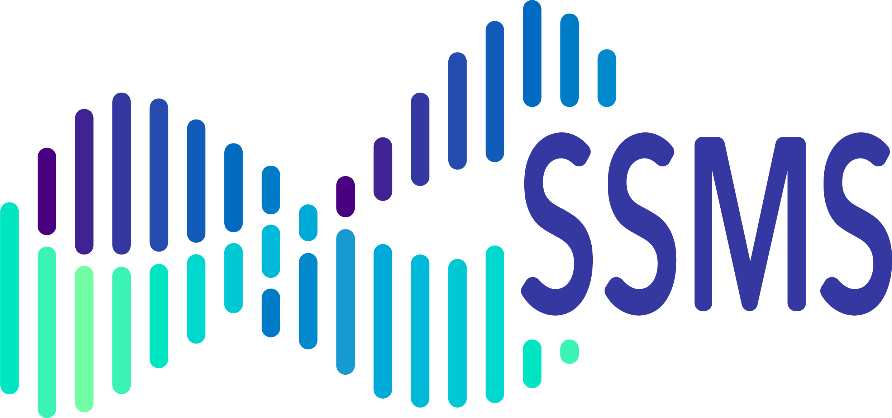

<div style="position: relative; width: 100%;">
  
  <a href="https://ccbs.carney.brown.edu/brainstorm" style="position: absolute; right: 0; top: 50%; transform: translateY(-50%);">
    
  </a>
</div>

# SSMS: Sequential Sampling Model Simulators

[](https://doi.org/10.5281/zenodo.17156205)

[](https://pepy.tech/projects/ssm-simulators)
[](https://github.com/lnccbrown/ssm-simulators/pulls)
[](https://pypi.org/project/ssm-simulators/)
[](https://github.com/lnccbrown/ssm-simulators/actions/workflows/run_tests.yml)
[](https://github.com/astral-sh/ruff)
[](https://opensource.org/licenses/MIT)
[](https://codecov.io/gh/lnccbrown/ssm-simulators)

`ssm-simulators` provides fast C/Cython simulators for sequential sampling
models used in cognitive science, neuroscience, and amortized Bayesian
inference, spanning classic DDM variants, multi-choice models, attention
models, and reinforcement-learning SSMs.

---

## At a Glance

| Need | Use ssms for |
| --- | --- |
| Simulate behavior | Generate response-time and choice data from a broad SSM library. |
| Train likelihood networks | Produce LAN/LANfactory-style training data with configurable simulators and KDE estimators. |
| Prototype models | Combine registered model configs, custom drift/boundary functions, parameter transforms, and Cython extensions. |
| Work with RLSSMs | Simulate trial-wise learning models, response-only choice models, and posterior predictive functions for RL workflows. |

Core links:

- Documentation: <https://lnccbrown.github.io/ssm-simulators/>
- API reference: <https://lnccbrown.github.io/ssm-simulators/api/ssms/>
- RLSSM API: <https://lnccbrown.github.io/ssm-simulators/api/rlssm/>
- Issues and feature requests: <https://github.com/lnccbrown/ssm-simulators/issues>

---

## Model Coverage

| Family | Examples |
| --- | --- |
| Diffusion models | DDM, full DDM, deadline variants, angle and Weibull boundaries, Levy, Ornstein-Uhlenbeck, gamma-drift, conflict, tradeoff, and shrink-spotlight variants. |
| Multi-choice accumulators | Race, racing diffusion, LBA, LBA4, LCA, and Poisson race models. |
| Attention models | aDDM with observed or self-sampled fixations, continuation strategies, and optional trajectory metadata. |
| Reinforcement-learning SSMs | Rescorla-Wagner learning rules, RT + choice RLSSMs, inverse-temperature softmax choice-only models, and response-only posterior predictive workflows. |

Choice-only RL support includes inverse-temperature softmax decision processes
for two-, three-, and four-choice settings. Built-in RL presets currently cover
two- and three-armed Rescorla-Wagner bandits:
`2AB_RW_InvTempSoftmax` and `3AB_RW_InvTempSoftmax`.

---

## Where ssms Fits

`ssm-simulators` is the simulator and data-generation layer of the HSSM
ecosystem.

| Package | Relationship |
| --- | --- |
| [HSSM](https://github.com/lnccbrown/HSSM) | Builds Bayesian inference workflows around simulator-defined model configurations, including ssms-defined RLSSMs. |
| [LANfactory](https://github.com/lnccbrown/LANfactory) | Trains likelihood approximation networks from ssms-generated simulation data. |
| [LAN_pipeline_minimal](https://github.com/lnccbrown/LAN_pipeline_minimal) | Orchestrates simulation and LAN training pipelines. |

The RLSSM path is ssms-first: ssms owns the learning rule, task environment,
response mapping, and simulator/PPC behavior; HSSM consumes the assembled model
contract through `hssm.rl.RLSSMConfig.from_ssms_model(...)` for inference.

---

## Installation

```sh
pip install ssm-simulators
```

Install the optional JAX backend for differentiable RLSSM learning processes:

```sh
pip install "ssm-simulators[jax]"
```

> [!NOTE]
> Multi-threaded simulation with `n_threads > 1` requires OpenMP and GSL.
> Install system dependencies first:
>
> ```bash
> # macOS
> brew install libomp gsl
>
> # Ubuntu/Debian
> sudo apt-get install build-essential libgsl-dev
> ```
>
> Then reinstall with `pip install --force-reinstall ssm-simulators`.
> Without these dependencies, the package still works in single-threaded mode.
>
> Building from source or developing this package requires a C compiler. Most
> users installing from PyPI wheels do not need to install GCC manually.

---

## Quick Starts

### Classic SSM Simulation

The `Simulator` class is the recommended user-facing API for direct simulation:

```python
from ssms.basic_simulators import Simulator

sim = Simulator("ddm")
out = sim.simulate(
    theta={"v": 1.0, "a": 1.5, "z": 0.5, "t": 0.2},
    n_samples=1000,
)

print(out["rts"].shape, out["choices"].shape)
```

### RLSSM Simulation

RLSSMs combine a trial-wise learning process, a task environment, and an SSM or
choice-only decision process:

```python
import ssms.rl as rl

config = rl.preset.get("2AB_RW_InvTempSoftmax")
sim = rl.Simulator(config)

data = sim.simulate(
    theta={"rl_alpha": 0.2, "beta": 2.0},
    n_trials=200,
    n_participants=20,
    random_state=42,
)

response_only = data.drop(columns=["rt"])
config.validate_data(response_only).raise_for_errors()
```

For choice-only models, the simulator keeps `rt=-1.0` only as a compatibility
placeholder in generative output. HSSM inference and ssms PPC use response-only
data.

---

## Tutorials

Start here:

- [Basic tutorial](https://lnccbrown.github.io/ssm-simulators/basic_tutorial/basic_tutorial/)
- [Package overview](https://lnccbrown.github.io/ssm-simulators/core_tutorials/tutorial_capabilities/)
- [RLSSM tutorial](https://lnccbrown.github.io/ssm-simulators/core_tutorials/rlssm_tutorial/)
- [RLSSM simulation and HSSM handoff](https://lnccbrown.github.io/ssm-simulators/core_tutorials/rlssm_simulation_hssm_handoff/)
- [Choice-only RL models](https://lnccbrown.github.io/ssm-simulators/core_tutorials/choice_only_rl_models/)
- [Contributing new models](https://lnccbrown.github.io/ssm-simulators/contributing/add_models/)

---

## Training Data CLI

The package exposes `generate` for creating training data from a YAML
configuration file:

```bash
generate [--config-path <path/to/config.yaml>] --output <output/directory> [--log-level INFO]
```

Common options:

| Option | Meaning |
| --- | --- |
| `--config-path` | YAML configuration path. Uses the default config if omitted. |
| `--output` | Output directory for generated data. |
| `--n-files` | Number of data files to generate. |
| `--estimator-type` | Likelihood estimator override, such as `kde` or `pyddm`. |
| `--log-level` | Logging level. |

Minimal YAML example:

```yaml
MODEL: "ddm"
GENERATOR_APPROACH: "lan"

PIPELINE:
  N_PARAMETER_SETS: 100
  N_SUBRUNS: 20

SIMULATOR:
  N_SAMPLES: 2000
  DELTA_T: 0.001

TRAINING:
  N_SAMPLES_PER_PARAM: 200

ESTIMATOR:
  TYPE: "kde"
```

---

## Parallel Execution

When using `n_threads > 1`, ssms uses GSL's validated Ziggurat algorithm for
Gaussian random number generation. The maximum supported number of threads is
256.

```python
from ssms.basic_simulators import Simulator

theta = {"v": 1.0, "a": 1.5, "z": 0.5, "t": 0.2}

sim = Simulator("ddm")
single_thread = sim.simulate(theta=theta, n_samples=10000, n_threads=1)
multi_thread = sim.simulate(theta=theta, n_samples=10000, n_threads=8)
```

Check your installation's parallel capabilities:

```python
from cssm._openmp_status import print_status

print_status()
```

---

## Development

This project uses `uv` for dependency management:

```bash
curl -LsSf https://astral.sh/uv/install.sh | sh
uv sync --all-groups
```

Rebuild Cython extensions after source changes:

```bash
uv pip install --python .venv/bin/python -e . --reinstall
```

Run the main local checks:

```bash
uv run pytest tests/
uv run ruff check .
uv run ruff format --check .
uv run --extra docs mkdocs build
```

---

## Contributing

Contributions are welcome, including new models, documentation improvements,
bug fixes, and simulator validation work.

- Add a model: <https://lnccbrown.github.io/ssm-simulators/contributing/add_models/>
- Add a parameter adapter: <https://lnccbrown.github.io/ssm-simulators/contributing/add_parameter_adapters/>
- Open an issue: <https://github.com/lnccbrown/ssm-simulators/issues>
- Open a pull request: <https://github.com/lnccbrown/ssm-simulators/pulls>

---

## Citation

Please cite `ssm-simulators` with the Zenodo DOI:
<https://doi.org/10.5281/zenodo.17156205>.
