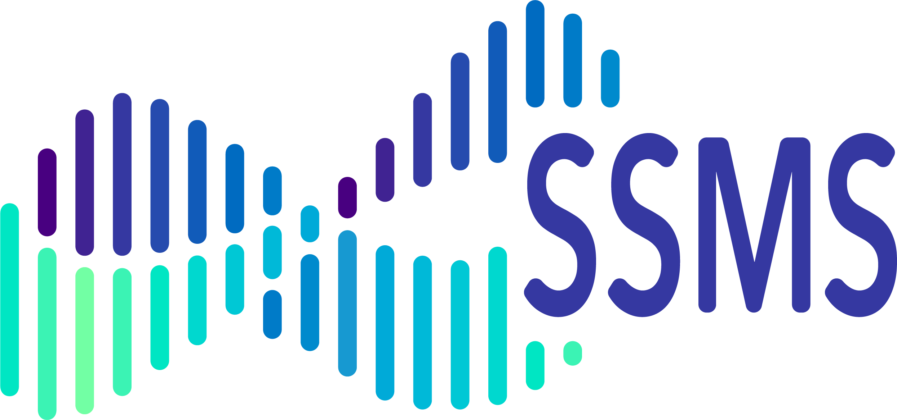

<div style="position: relative; width: 100%;">
  
  <a href="https://ccbs.carney.brown.edu/brainstorm" style="position: absolute; right: 0; top: 50%; transform: translateY(-50%);">
    
  </a>
</div>

# SSMS: Sequential Sampling Model Simulators

[](https://doi.org/10.5281/zenodo.17156205)

[](https://pepy.tech/projects/ssm-simulators)
[](https://github.com/lnccbrown/ssm-simulators/pulls)
[](https://pypi.org/project/ssm-simulators/)
[](https://github.com/lnccbrown/ssm-simulators/actions/workflows/run_tests.yml)
[](https://github.com/astral-sh/ruff)
[](https://opensource.org/licenses/MIT)
[](https://codecov.io/gh/lnccbrown/ssm-simulators)

`ssm-simulators` provides fast C/Cython simulators for sequential sampling
models used in cognitive science, neuroscience, and amortized Bayesian
inference. It is the simulator and training-data layer of the
[HSSM ecosystem](https://lnccbrown.github.io/HSSM/ecosystem/).

## Install

```bash
pip install ssm-simulators
```

The [documentation](https://lnccbrown.github.io/ssm-simulators/) is the
canonical source for optional backends, OpenMP/GSL prerequisites, tutorials,
model coverage, configuration, and API contracts.

## Start here

- [Simulate and inspect your first SSM](https://lnccbrown.github.io/ssm-simulators/basic_tutorial/basic_tutorial/)
- [Simulate your first RLSSM](https://lnccbrown.github.io/ssm-simulators/core_tutorials/rlssm_tutorial/)
- [Create a custom model](https://lnccbrown.github.io/ssm-simulators/core_tutorials/tutorial_custom_models/)
- [Browse the API reference](https://lnccbrown.github.io/ssm-simulators/api/basic_simulators/)
- [Report an issue](https://github.com/lnccbrown/ssm-simulators/issues)

## Contributing

Install the development environment, then run the package and documentation
gates:

```bash
uv sync --extra dev
uv run pytest tests/
uv run pytest tests/test_notebooks.py --run-notebooks --no-cov -v
uv run ruff check .
uv run ruff format --check .
./scripts/docs.sh build
```

Preview documentation changes with `./scripts/docs.sh serve`. See the
[contribution guide](https://lnccbrown.github.io/ssm-simulators/contributing/)
and [new-model guide](https://lnccbrown.github.io/ssm-simulators/contributing/add_models/)
for durable development guidance.

## Citation

Please cite `ssm-simulators` with its
[Zenodo DOI](https://doi.org/10.5281/zenodo.17156205).

## License

`ssm-simulators` is distributed under the [MIT License](LICENSE).
