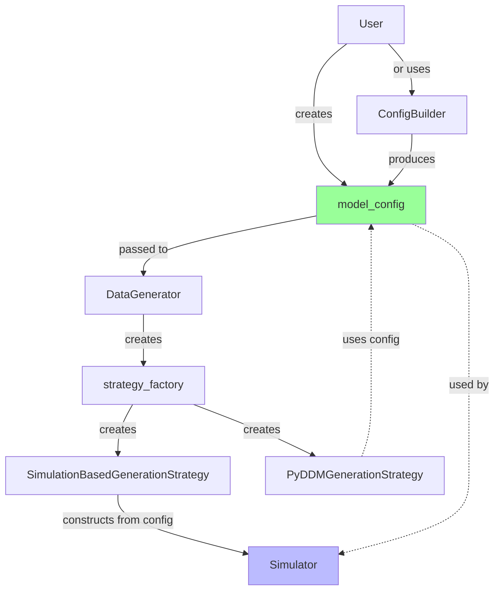

# Config-Based Simulator Construction

## Overview

As of this refactor, the `DataGenerator` and its strategies use **config-based simulator construction**, where the `model_config` serves as the single source of truth for model specifications. This ensures consistency between simulation-based (KDE) and analytical (PyDDM) strategies.

## Design Rationale

### Problem

Previously, strategies accepted an optional `simulator: Optional[Simulator] = None` parameter, allowing users to pass pre-constructed `Simulator` instances. While this provided flexibility, it created potential issues:

1. **Config/Instance Mismatch**: A user could pass a `Simulator` configured for model "ddm" while passing a `model_config` for "angle", leading to inconsistencies
2. **Duplicate Configuration**: The same information existed in both the `model_config` and the `Simulator` instance
3. **API Confusion**: It wasn't clear whether to customize via config or via constructor

### Solution

**Strategies now construct their `Simulator` instances directly from `model_config`**, eliminating the optional parameter. This ensures:

- **Single Source of Truth**: The `model_config` fully specifies the model
- **Consistency**: Both KDE and PyDDM strategies work from the same config
- **Clarity**: Users customize via `model_config` or `ConfigBuilder`

## Architecture



## Usage

### Standard Usage (Built-in Model)

```python
from ssms.dataset_generators.lan_mlp import DataGenerator
from ssms.config import model_config, DataGenerator_config

# Create DataGenerator - simulator constructed automatically from model_config
dg = DataGenerator(
    generator_config=DataGenerator_config['lan'],
    model_config=model_config['ddm']
)

# The strategy internally constructs: Simulator(model="ddm")
```

### Custom Drift/Boundary Functions

Use `ConfigBuilder` to create a custom `model_config`:

```python
from ssms.config import ConfigBuilder
import numpy as np

# Define custom boundary
def exponential_boundary(t, rate, scale):
    return scale * np.exp(-rate * t)

# Create custom config
custom_config = ConfigBuilder.from_model(
    "ddm",
    boundary=exponential_boundary,
    boundary_params=["rate", "scale"],
    boundary_multiplicative=True
)

# Add boundary parameter bounds
custom_config["param_bounds_dict"]["rate"] = (0.1, 2.0)
custom_config["param_bounds_dict"]["scale"] = (0.5, 1.5)

# Use with DataGenerator
dg = DataGenerator(
    generator_config=config,
    model_config=custom_config
)
```

### Fully Custom Simulator

```python
def my_custom_simulator(v, a, z, t, max_t=20, n_samples=1000, **kwargs):
    """Custom simulation logic."""
    # ... your implementation ...
    return {
        'rts': rts,
        'choices': choices,
        'metadata': {'model': 'custom', 'n_samples': n_samples}
    }

custom_config = ConfigBuilder.from_scratch(
    name="my_model",
    params=["v", "a", "z", "t"],
    simulator_function=my_custom_simulator,
    nchoices=2,
    param_bounds=[[-3, 0.3, 0.1, 0], [3, 2.5, 0.9, 2.0]]
)

dg = DataGenerator(
    generator_config=config,
    model_config=custom_config
)
```

## Benefits

1. **Consistency**: The same `model_config` works seamlessly for both KDE (simulation-based) and PyDDM (analytical) strategies
2. **Flexibility**: `ConfigBuilder` provides powerful tools for customization without needing to construct `Simulator` instances manually
3. **Maintainability**: Single configuration point reduces bugs from config/instance mismatches
4. **Extensibility**: New strategies can be added without changing the configuration interface

## Advanced: Custom Models with Parameter Transforms

The config-based approach integrates seamlessly with the modular parameter transform system:

```python
from ssms.config import ConfigBuilder

custom_config = ConfigBuilder.from_model(
    "lba_3",
    param_bounds=[[-3, -3, -3, 0.3, 0.1, 0], [3, 3, 3, 2.5, 0.9, 2.0]]
)

# Add custom transforms
custom_config["parameter_transforms"] = [
    {
        "type": "normalize",
        "param_names": ["v1", "v2", "v3"]
    },
    {
        "type": "swap",
        "param_a": "a",
        "param_b": "z"
    }
]

# DataGenerator will automatically apply these transforms during sampling
dg = DataGenerator(
    generator_config=config,
    model_config=custom_config
)
```

## Implementation Details

### SimulationBasedGenerationStrategy

```python
class SimulationBasedGenerationStrategy:
    def __init__(
        self,
        generator_config: dict,
        model_config: dict,
        estimator_builder: EstimatorBuilderProtocol,
        training_strategy: TrainingDataStrategyProtocol,
    ):
        # Construct simulator from model_config (single source of truth)
        self.simulator = Simulator(model=model_config["name"])

        # ... rest of initialization ...
```

### PyDDMGenerationStrategy

The PyDDM strategy doesn't use a `Simulator` instance but still relies on `model_config` for parameter bounds, transforms, and model specifications. This ensures both strategies share the same configuration interface.

## Backward Compatibility

The refactor maintains full backward compatibility:
- Existing code that passes only `model_config` works unchanged
- Legacy `DataGenerator.get_simulations()` method still available (uses function-based `simulator()`)
- All existing model configs work without modification

## Future Considerations

If stateful simulators become necessary (e.g., neural network-based simulators with pre-loaded weights), we can:
1. Extend `ConfigBuilder` to accept simulator instances within config
2. Add a `simulator_instance` field to `model_config`
3. Keep the config-first principle while accommodating advanced use cases

For now, the config-based approach provides the right balance of flexibility and consistency.
